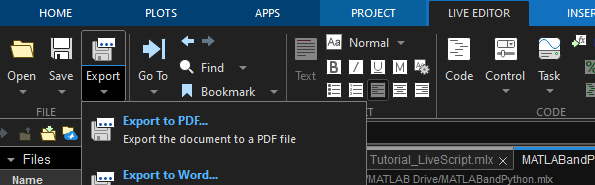
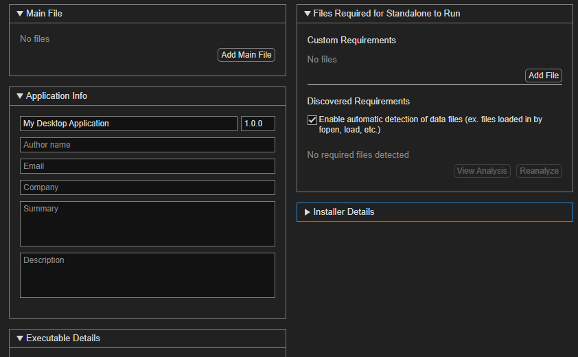
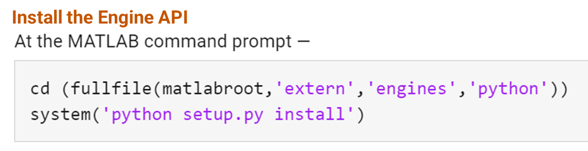
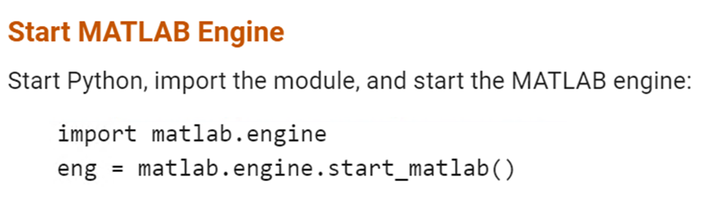

<a id="T_3747"></a>

# Running Python with MATLAB
<!-- Begin Toc -->

## Table of Contents
&emsp;[Call Python from MATLAB](#H_6262)
 
&emsp;&emsp;[Option 1: Setup a Python Environment](#H_73f2)
 
&emsp;&emsp;[Option 2: Use the Python Live Task](#H_90b4)
 
&emsp;&emsp;[Export MATLAB as...](#H_5d9e)
 
&emsp;&emsp;[Compile MATLAB Code as a Standalone Executable or as Python Code](#H_4c38)
 
&emsp;[Call MATLAB from Python](#H_765d)
 
<!-- End Toc -->
<a id="H_6262"></a>

# Call Python from MATLAB
<a id="H_73f2"></a>

## Option 1: Setup a Python Environment

Check which version of Python is installed and that it is on your MATLAB path. if running on matlab online, a version of Python is already installed on the MathWorks' servers.

```matlab
py = pyenv % or pyenv()

if py.Version == ""
    disp "Python not installed"
end
```

If multiple versions of Python are detected or installed on your computer, specify the version of Python you want to run:

```matlab
%pyenv(Version="3.11");
```

If you downloaded a Python interpreter, but did not register it in the Windows registry, use:

```
pyenv(Version="[executable]") % where [executable] is the path where the interpreter launches python.exe from

% For example
pyenv(Version="C:\Users\username\AppData\Local\Programs\Python\Python311\python.exe");
```

Check to see if your environment is initialized. Did you receive an error? Are all of your Python libraries installed?

```matlab
% Calculate the square root of 42 using Python
result = pyrun("import math; sqrt_value = math.sqrt(42); sqrt_value", "sqrt_value");
```

Once your Python Environment (pyenv) is initialized, try this:

```
pyrun("import math; sqrt_value = math.sqrt(75); sqrt_value")
```
```matlab
% Type your python code here
v = pyrun("import math; sqrt_value = math.sqrt(75); sqrt_value")
```

Did your code run? What happened? What do you need to change? What inputs do you have to specify?

```matlab
% SPOILER ALERT: you have to specify which variable you want it to return
% back to MATLAB
% result = pyrun("import math; sqrt_value = math.sqrt(75); sqrt_value", "sqrt_value");
```
<a id="H_90b4"></a>

## Option 2: Use the Python Live Task

Navigate to your toolstrip and select the Live Editor tab. In the Code section, select Task. Search for and select "Run Python Code".


<a id="H_5d9e"></a>

## Export MATLAB as...

In the toolstrip, navigate to Live Editor > Export > Export to...




<a id="H_4c38"></a>

## Compile MATLAB Code as a Standalone Executable or as Python Code
<a id="H_2de5"></a>

(not available in online version)


In the toolstrip, navigate to Apps > Standalone Application Compiler.





Example: sunpy.mlapp

```matlab
open sunpy.mlapp
sunpy
```
<a id="H_765d"></a>

# Call MATLAB from Python

[MATLAB Engine for Python](https://pypi.org/project/matlabengine/) \- make sure you download the version that's compatible with the version of MATLAB you're using!


[Call MATLAB from Python](./CallMATLABfromPython/CallMATLABfromPython.ipynb) \- MATLAB can read ipynb files, but let's open in this in another IDE of your choice.





within your Python editor, 





*© The MathWorks, Inc. 2025*

